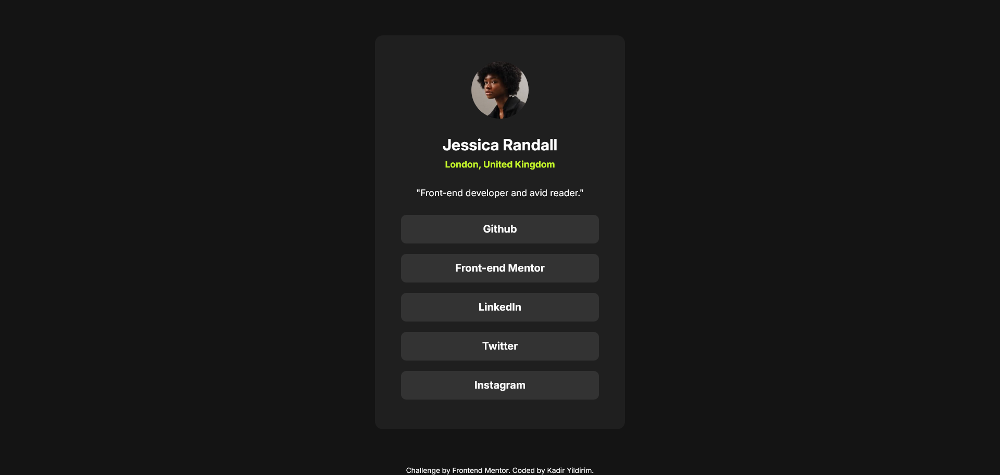

## Table of contents

-   [Overview](#overview)
    -   [Screenshot](#screenshot)
    -   [Links](#links)
-   [My process](#my-process)
    -   [Built with](#built-with)
    -   [Useful resources](#useful-resources)

## Overview

### Screenshot

### Links

-   Solution URL: [Add solution URL here]()
-   Live Site URL: [Add live site URL here]()

## My process

### Built with

-   Semantic HTML5 markup
-   Flexbox
-   Tailwind

### Useful resources

-   [Example resource 1](https://tailwindcss.com/) - Tailwind made it easier for me to give css styles. I will use it in my other projects.
